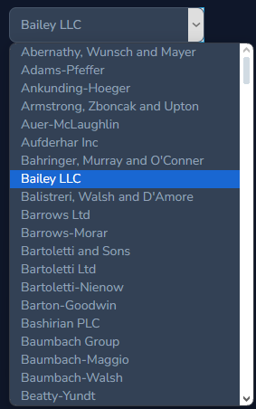

# Laravel Nova Menu Switcher

## Description

Creates input select that refreshes page and sets value to session.




## Installation 

```shell
composer require wamesk/laravel-nova-menu-switcher
```

## Usage

```php
// NovaServiceProvider.php
Nova::mainMenu(function (Request $request) {
    return [
        ...
        Switcher::make([
            'value1' => 'option1',
            'value2' => 'option2',
            'value3' => 'option3',
        ], 'option', 'value2'),
        ...
    ];
});
```

If you want to control who can use switcher you can add can_use_switcher attribute in user

```php
// User.php
public function getCanUseSwitcherAttribute(): bool
{
    return $this->is_super_admin;
}
```
